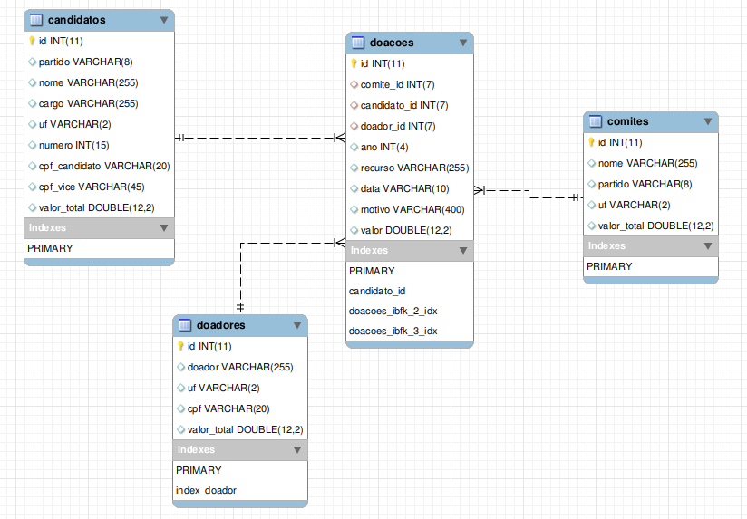

# -| Tribuna Eleitoral |-

----
### O que é?

Esse projeto **corrige, integra, estrutura e otimiza as receitas brutas** da *Prestação de Contas do Tribunal Superior Eleitoral*, disponível no [Repositório de Dados Eleitorais](http://www.tse.jus.br/eleicoes/estatisticas/repositorio-de-dados-eleitorais/), num Banco de Dados Relacional preparado para inquéritos, além de propor ferramentas abertas que facilitem sua relevante investigação por jornalistas, hackers e ativistas.

----

### Por quê?

Planilhas são inviáveis para relacionar informação nessa escala. Em 2014 foi necessário analisar os caóticos dados providos pelo TSE na pesquisa e apuração de **jornalismo investigativo** que resultou na matéria [As quatro irmãs](http://apublica.org/2014/06/as-quatro-irmas/);
> Negócios familiares, proximidade com governos, financiamento de campanhas e diversificação de atividades – da telefonia ao setor armamentício – compõem a história das gigantes Odebrecht, OAS, Camargo Corrêa e Andrade Gutierrez.

Porém, muitos *"furos"* e **indícios de corrupção e atos ilícitos** ainda podem ser evidenciados cruzando esses dados entre *Doadores, Candidatos e Partidos*, revelando - a princípio - os financiamentos e influências no Poder Público dos últimos 15 anos. Fatos ainda inexplorados e ocultos na *Política Brasileira* agora se tornam *acessíveis e apuráveis*.

Em 2017, o projeto Tribuna foi base para a investigação sobre financiamento de campanha da Odebrecht, que resultou em uma série de matérias publicadas no [The Intercept Brasil](https://theintercept.com/2017/09/26/mapeamento-inedito-mostra-que-doacoes-legais-da-odebrecht-beneficiaram-1-087-candidatos-desde-2002/).

---

### Como?

O script **auditável** proposto [ilumina.sh](ilumina.sh) pega as fontes oficiais e estrutura o banco de dados relacional num processo automático que pode levar mais de 8 horas de processamento de dados. Ver a [Metodologia](doc/metodologia.md).

---

### Resultado

- Download do [dump em SQL](https://drive.google.com/file/d/1XGzP4gVPXBNE8P8MYHoLvgkUGEWLPO6v/view?usp=sharing) da base de dados.

Estes dumps acima possui apenas uma tabela. No entanto, caso o trecho do [script que realiza a abstração](/scripts/sql_load_csv/x_ilumina_db.sql) seja descomentado, o banco de dados terá uma modelagem tal como a proposta abaixo:

---

### Links

- [Conceitos básicos e dicas](https://github.com/rafapolo/tribuna/wiki/Como-analisar-os-dados-do-TSE) para trabalhar com os dados do TSE 
- [Dashboard](https://meta.mostre.me/public/dashboard/af26d09e-2994-4e39-8593-49e8a87fe5f5) básico com dados da Tribuna
- [Wiki](https://github.com/rafapolo/tribuna/wiki/SQL) de inquéritos básicos em [SQL](https://pt.wikipedia.org/wiki/SQL)
- [tse-monit](http://git.mostre.me/rafapolo/tse-monit) para monitorar mudanças
- [Mostre!me Eleições](https://mostre.me/eleicoes) subversão 0.1
---
