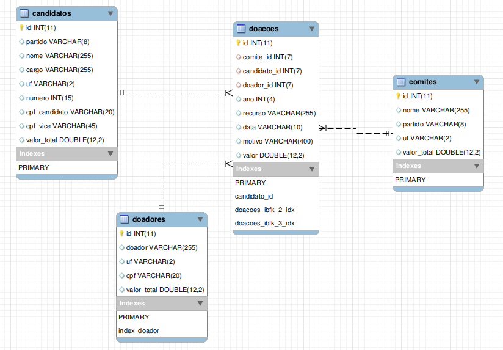

## Metodologia

- MySQL como Sistema Gerenciador de Banco de Dados

- Após analise intuitiva de cada arquivo .CSV (valores separados por vírgulas) disponibilizado no [[www.tse.jus.br/eleicoes/estatisticas/repositorio-de-dados-eleitorais|Repositório de Dados Eleitorais do TSE]] contendo os dados de Doações para Candidados e Comites, a seguinte *tabela* é proposta;

```sql
CREATE TABLE `doacoes2` (
  `uf` varchar(2) NOT NULL,
  `id` int(11) unsigned NOT NULL AUTO_INCREMENT,
  `partido` varchar(8) DEFAULT NULL,
  `cargo` varchar(255) DEFAULT NULL,
  `nome` varchar(255) DEFAULT NULL,
  `numero` int(15) DEFAULT NULL,
  `ano` int(4) DEFAULT NULL,
  `cpf` varchar(20) DEFAULT NULL,
  `doador` varchar(255) DEFAULT NULL,
  `recurso` varchar(20) DEFAULT NULL,
  `data` varchar(20) DEFAULT NULL,
  `motivo` varchar(400) DEFAULT NULL,
  `valor` double(12,2) DEFAULT NULL,
  `empresa` tinyint(1) DEFAULT NULL,
  `tipo` varchar(20) DEFAULT NULL,
  PRIMARY KEY (`id`)
) ENGINE=InnoDB AUTO_INCREMENT=0 DEFAULT CHARSET=utf8;
```

- Como cada arquivo .CSV do TSE tem uma estrutura (layout) diferente, é necessária uma adaptação no SQL de importação.

Como exemplo, para importar a prestação de contas dos candidatos de 2016:

```sql
use tse;
load data local infile './fontes_tse/2016/receitas_candidatos_prestacao_contas_final_2016_brasil.csv '
  into table doacoes
    fields terminated by ';'
    enclosed by '"'
    lines terminated by '\n'
    ignore 1 lines
    (@cod, @desc, @data, @pretador, @seqcand, @uf, @nomeuf, @siglauf, @partido,
    @numero, @cargo, @nome, @cpfcandidato, @cpfvice, @recibo, @numdoc, @cpf,
      @doador, @nomdoadreceita, @uf_doador, @numpart, @numcandd, @codseeco,
        @seteco, @data, @valor, @tipo, @fonte, @especie,
          @descrec, @cpforiginario, @nomedoador, @tipodoro, @setorigi, @nomeorig)
SET
    ano="2016", tipo="candidato",
  uf = @uf, nome=@nome, cargo=@cargo, numero=@numero, cpf=@cpf, cpf_vice=@cpfvice, cpf_candidato=@cpfcandidato,
  doador=@doador, partido=@partido,
  recurso = @tipo,
  motivo = @descrec,
  data=left(@data , 10),
  valor=cast(replace(@valor, ',', '.') AS decimal( 9, 2 ) )
```
e para os comites

```sql
use tse;
load data local infile './fontes_tse/2016/receitas_partidos_prestacao_contas_final_2016_brasil.csv'
  into table doacoes
    fields terminated by ';'
    enclosed by '"'
    lines terminated by '\n'
    ignore 1 lines

    (@cod, @desc, @data, @pretador, @seqcand, @uf, @nomeuf, @siglauf, @tipodiretorio, @partido,
    @numero, @numdoc, @cpf, @doador, @nomdoadreceita, @uf_doador, @numero, @numcandd, @codseeco,
        @seteco, @data, @valor, @tipo, @fonte, @especie,
          @descrec, @cpforig, @nomedoador, @tipodoro, @setorigi, @nomeorig)
  SET
    ano="2016", tipo="partido",
  uf = @uf, nome=@tipodiretorio, cpf=@cpforig,
  doador=@doador, partido=@partido,
  numero=@numero,
    cpf_candidato=@cpf,
  recurso = @tipo,
  motivo = @descrec,
  data=left(@data , 10),
  valor=cast(replace(@valor, ',', '.') AS decimal( 9, 2 ) )
```

Com a tabela *doacoes* contendo os dados de todos os CVSs, muitas consultas já podem ser realizadas, mas vamos abstrair as redundancias pra otimizar as possíveis consultas.

Extrair *Candidatos*
```sql
CREATE TABLE candidatos
  select partido, uf, nome, cargo, numero, cpf_candidato, cpf_vice
    from doacoes
      where tipo="candidato"
      group by partido, uf, nome, cargo, numero, cpf_candidato, cpf_vice

update candidatos set cpf_vice=null where cpf_vice="#NULO";

ALTER TABLE `tse`.`candidatos`
  ADD COLUMN `id` INT NOT NULL AUTO_INCREMENT FIRST,
  ADD PRIMARY KEY (`id`);
```

Extrair *Doadores*
```sql
create table doadores
  select doador, uf, cpf
    from doacoes
      group by doador, uf, cpf

update doadores set cpf=null where cpf="#NULO";

ALTER TABLE `tse`.`doadores`
  ADD COLUMN `id` INT NOT NULL AUTO_INCREMENT FIRST,
  ADD PRIMARY KEY (`id`);
```

Extrair *Comites*
```sql
create table comites
  SELECT nome, partido, uf
  FROM tse.doacoes where tipo != 'candidato'
    group by nome, partido, uf
ALTER TABLE `tse`.`comites`
  ADD COLUMN `id` INT NOT NULL AUTO_INCREMENT FIRST,
  ADD PRIMARY KEY (`id`);
```

Preparar tabela geral *doacoes* para apontar para as novas tabelas de doadores, candidatos e comites.
```sql
CREATE INDEX index_doador ON doadores ( doador, uf, cpf );
CREATE INDEX index_doador ON doacoes ( doador, uf, cpf );

ALTER TABLE `tse`.`doacoes`
  ADD COLUMN `candidato_id` INT(7) NULL AFTER `id`,
  ADD COLUMN `doador_id` INT(7) NULL AFTER `candidato_id`;
  ADD COLUMN `comite_id` INT(7) NULL AFTER `doador_id`;

CREATE INDEX index_candidato ON candidatos ( nome, cpf_candidato, numero, partido, ano, cargo );
CREATE INDEX index_candidato ON doacoes ( nome, cpf_candidato, numero, partido, ano, cargo );

# atribui doadores
update doacoes d, doadores dd
  set d.doador_id = dd.id
    where dd.doador = d.doador and d.uf=dd.uf and d.cpf=dd.cpf;
# Query OK, 3696309 rows affected (44 min 46.83 sec)

# atribui candidatos
update doacoes d, candidatos c
  set d.candidato_id = c.id
    where c.nome = d.nome and c.cpf_candidato=d.cpf_candidato
      and c.numero=d.numero and c.partido=d.partido
        and c.ano=d.ano and c.cargo=d.cargo
# Query OK, 2935487 rows affected (30 min 0.58 sec)

# atribui partidos
update doacoes d, comites c
  set d.comite_id = c.id
    where d.partido = c.partido and d.nome=c.nome and c.uf=d.uf

ALTER TABLE `tse`.`doacoes`
ADD INDEX `doacoes_ibfk_1_idx` (`candidato_id` ASC),
ADD INDEX `doacoes_ibfk_2_idx` (`comite_id` ASC),
ADD INDEX `doacoes_ibfk_3_idx` (`doador_id` ASC);
ADD CONSTRAINT `doacoes_ibfk_1`
  FOREIGN KEY (`candidato_id`)
  REFERENCES `tse`.`candidatos` (`id`)
ADD CONSTRAINT `doacoes_ibfk_2`
  FOREIGN KEY (`comite_id`)
  REFERENCES `tse`.`comites` (`id`)
ADD CONSTRAINT `doacoes_ibfk_3`
  FOREIGN KEY (`doador_id`)
  REFERENCES `tse`.`doadores` (`id`)
```

Remove informações da tabela *doacoes* que foram abstraidas para respectivas tabelas.
```sql
ALTER TABLE `tse`.`doacoes`
  DROP COLUMN `cpf_candidato`,
  DROP COLUMN `cpf_vice`,
  DROP COLUMN `doador`,
  DROP COLUMN `cpf`,
  DROP COLUMN `numero`,
  DROP COLUMN `nome`,
  DROP COLUMN `cargo`,
  DROP COLUMN `partido`,
  DROP COLUMN `tipo`,
  DROP COLUMN `uf`,
  DROP INDEX `index_candidato` ,
  DROP INDEX `index_doador` ;
```

Cria nova coluna em Candidatos, Comites e Doadores com soma geral de valores gastos ou doados.
```sql
ALTER TABLE `tse`.`comites`
ADD COLUMN `valor_total` DOUBLE(12,2) NULL AFTER `uf`;

update comites c,
  (select comite_id, sum(valor) as soma from doacoes group by comite_id) as d
  set c.valor_total = d.soma
    where d.comite_id = c.id

ALTER TABLE `tse`.`doadores`
ADD COLUMN `valor_total` DOUBLE(12,2) NULL AFTER `cpf`;

update doadores dd,
  (select doador_id, sum(valor) as soma from doacoes group by doador_id) as d
  set dd.valor_total = d.soma
    where dd.doador_id = d.id

ALTER TABLE `tse`.`candidatos`
ADD COLUMN `valor_total` DOUBLE(12,2) NULL AFTER `cpf_vice`;

update candidatos c,
  (select candidato_id, sum(valor) as soma from doacoes group by candidato_id) as d
  set c.valor_total = d.soma
    where d.candidato_id = c.id
```

Por fim temos a seguinte estrutura


